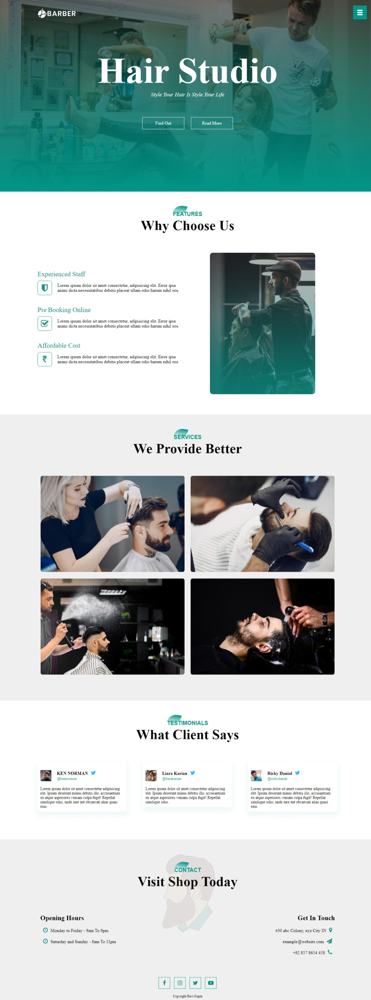

# 📝 Barber Shop

This repository contains the code for a simple yet stylish barber shop website, built using **HTML** and **CSS**.

## 🚀 Features

- **Responsive Design**: The website adapts seamlessly to different screen sizes, ensuring a great user experience on desktops, tablets, and mobiles.
- **Attractive Visuals**: The design incorporates clean lines, a soothing color palette, and high-quality images, creating a professional and inviting atmosphere.
- **Smooth Scrolling**: Navigate the website effortlessly with smooth transitions between sections.
- **Interactive Elements**: Hover effects and transitions add a touch of dynamism to the design.

## 🌐 Visit App

You can view a live demo of the website [here](https://gupta-ravi.github.io/barberShop/).


## 💻 Technologies Used

This project utilizes the following technologies:

**Front-End:**

* **HTML:**  The structure and content of the website are defined using HTML.
* **CSS:**  Styling and layout are implemented through CSS, including the use of:
    *  **Flexbox:** For responsive layouts and alignment of elements.
    *  **Transitions and Animations:** To create visual effects and improve the user experience.
* **JavaScript:**  Used for adding interactivity to the website:
    * **Smooth Scrolling:** Enables seamless navigation between sections. 
    * **Mobile Menu:** Creates a responsive menu for smaller screens. 


**External Libraries/Frameworks:**

* **Font Awesome:** Icons are included using Font Awesome for a visually appealing interface.
* **Smooth Scroll:** This JavaScript library enables smooth scrolling for anchor links. 

**No back-end technologies are used in this project, as it is a static website.**
## 📂 Project Structure

## 📋 Usage

1. **Clone the Repository**
    ```bash
    git clone https://github.com/gupta-ravi/barberShop.git
    ```
2. **Open `index.html` in your Browser**

## 📺 Tutorial

For a step-by-step tutorial on building this Website, check out the video [here](https://youtu.be/lBfshkPlMW8).


## 📸 Screenshots



## 👏 Contributing

Feel free to contribute to this project by submitting issues or pull requests.

## 📄 License

This project is licensed under the MIT License

---

Thank you for checking out the Website! Happy coding! 🎉
